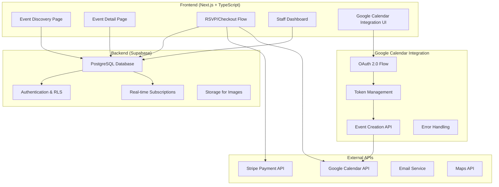

# LocalLoop Application Architecture

## System Overview

LocalLoop is a lightweight, community events platform designed for small local organisations to share and manage events with community members. It supports both free and paid events, allowing users to RSVP, purchase tickets, and **add events directly to their Google Calendar via Google Calendar API integration** — all via a mobile-friendly web app.

### Tech Stack
* **Frontend:** Next.js (from 1000x-app template) with Tailwind CSS
* **Backend:** Supabase (Postgres, Auth, Storage, RLS)
* **Calendar Integration:** **Google Calendar API with OAuth 2.0** (Primary Client Requirement)
* **Payments:** Stripe (checkout, webhooks)
* **Testing:** Playwright E2E
* **Deployment:** Vercel
* **Optional:** Resend or Mailgun (emails), PostHog (later for analytics)

### Key Differentiators
Unlike platforms like Eventbrite, LocalLoop:
* Emphasises **community-first UX** with mobile-friendly RSVP tools
* Offers **staff dashboards** for simple event control
* **Integrates directly with Google Calendar API** for one-click event creation (Client Requirement)
* Provides **fallback .ics downloads** for non-Google calendar users
* Allows **guest access** for fast RSVP or ticket flow
* Provides a foundation for future **social and native features**

## 🔑 Critical Client Requirement: Google Calendar API Integration

**PRIMARY REQUIREMENT:** Direct Google Calendar API integration for seamless event addition to users' calendars.

### Implementation Requirements:
- **Google Calendar API v3** integration
- **OAuth 2.0 authentication flow** for calendar permissions
- **Token storage and refresh** management in Supabase
- **One-click "Add to Google Calendar"** functionality
- **Error handling** for API failures and rate limits
- **Fallback .ics download** for non-Google users

### Environment Setup:
- Google Cloud Console project configuration
- Google Calendar API credentials (OAuth 2.0 client)
- Proper scopes: `https://www.googleapis.com/auth/calendar.events`

## System Architecture Diagram



## Launch Features (MVP)

### Event Discovery & Browsing
**A mobile-optimized event discovery interface that allows users to browse upcoming community events with filtering capabilities by date and category, presenting events in an engaging and accessible format.**

* Homepage with featured and upcoming events listing
* Filter events by date ranges (Today, This Weekend, Next Week)
* Filter events by category (Workshop, Meeting, Social, etc.)
* Search functionality with basic keyword matching
* Mobile-responsive design with touch-friendly UI elements
* Guest access without requiring account creation

#### Tech Involved
* Next.js frontend with SSR for SEO optimization
* Tailwind CSS for responsive design
* Supabase Postgres for event data storage
* React Query for data fetching and caching

#### Main Requirements
* Fast-loading event cards with essential information
* Intuitive filtering and sorting mechanisms
* Accessibility compliance (WCAG standards)
* SEO-friendly event pages for discoverability

### Event Detail & RSVP
**Comprehensive event detail pages that showcase all relevant information about an event and provide streamlined RSVP functionality for free events, with a frictionless user experience that works for both logged-in and guest users.**

* Detailed event information (description, location, time, organizer)
* Interactive map integration for location
* RSVP functionality for free events
* Attendee count/capacity indicator
* Share event via social media or direct link
* **Google Calendar API integration for direct event creation** (Primary Client Requirement)
* **Fallback .ics download** for non-Google calendar users

#### Tech Involved
* Next.js dynamic routes for event pages
* Supabase RLS for secure data access
* **Google Calendar API v3 with OAuth 2.0** (Client Requirement)
* **googleapis and google-auth-library** npm packages
* Mapbox or Google Maps API for location display

#### Main Requirements
* One-click RSVP for logged-in users
* Simple guest RSVP flow with minimal friction
* **Seamless Google Calendar integration** with proper error handling
* **OAuth token management** for long-term calendar access
* Mobile-optimized viewing experience

### Ticketing & Payments
**Secure and streamlined ticketing system for paid events that handles payment processing, ticket issuance, and confirmation, with support for different ticket types and pricing tiers.**

* Stripe integration for secure payments
* Multiple ticket types/tiers per event
* Quantity selection for tickets
* Order summary before checkout
* Email confirmation with ticket details
* QR code or confirmation number for entry
* **Google Calendar integration for paid events** post-purchase

#### Tech Involved
* Stripe Checkout for payment processing
* Stripe Webhooks for payment confirmation
* Supabase for ticket and order storage
* Email service (Resend or Mailgun) for confirmations
* **Google Calendar API** for post-purchase calendar integration

#### Main Requirements
* PCI-compliant payment processing
* Reliable webhook handling for payment status
* Clear receipt and confirmation delivery
* Refund capability for organizers
* **Calendar integration after successful payment**

### User Accounts & Profiles
**Simple account system that allows users to track their RSVPs and tickets, with optional registration that doesn't impede the core RSVP and ticketing flows.**

* Optional account creation
* Social login options (Google, Apple)
* Email verification
* Profile with upcoming and past events
* Saved payment methods (optional)
* Email preferences management
* **Google Calendar connection status and management**

#### Tech Involved
* Supabase Auth for authentication
* **Google OAuth 2.0** for both social login and calendar access
* Next.js middleware for protected routes
* Secure cookie handling for sessions
* Row-level security in Supabase
* **Encrypted token storage** for Google Calendar API

#### Main Requirements
* Frictionless guest checkout option
* Secure credential storage
* Easy conversion from guest to registered user
* GDPR-compliant data handling
* **Google Calendar permission management**

### Staff Dashboard
**Administrative interface for event organizers to create, manage, and monitor events, with tools for tracking RSVPs, ticket sales, and attendee information.**

* Event creation and management
* RSVP and ticket sales monitoring
* Attendee list management
* Basic analytics on event performance
* Export functionality for attendee data
* Event duplication for recurring events

#### Tech Involved
* Protected Next.js routes for admin access
* Supabase RLS policies for secure data access
* React data visualization libraries for analytics
* CSV export functionality

#### Main Requirements
* Intuitive event creation form with validation
* Real-time updates on RSVP and ticket sales
* Role-based access control for staff members
* Bulk actions for attendee management

## Google Calendar API Integration Architecture

### Authentication Flow
```typescript
// Google Calendar OAuth 2.0 Configuration
interface GoogleCalendarConfig {
  clientId: string;
  clientSecret: string;
  redirectUri: string;
  scopes: ['https://www.googleapis.com/auth/calendar.events'];
}

// OAuth Flow Implementation
interface OAuthFlow {
  initiateAuth(): Promise<string>; // Returns authorization URL
  handleCallback(code: string): Promise<TokenResponse>;
  refreshToken(refreshToken: string): Promise<TokenResponse>;
  revokeAccess(accessToken: string): Promise<void>;
}
```

### Event Creation API
```typescript
// Google Calendar Event Structure
interface GoogleCalendarEvent {
  summary: string; // Event title
  description: string; // Event description
  start: {
    dateTime: string; // ISO 8601 format
    timeZone: string;
  };
  end: {
    dateTime: string;
    timeZone: string;
  };
  location?: string; // Event address
  attendees?: Array<{
    email: string;
    displayName?: string;
  }>;
}

// Calendar Integration Service
interface CalendarService {
  createEvent(event: GoogleCalendarEvent, accessToken: string): Promise<string>;
  updateEvent(eventId: string, event: GoogleCalendarEvent, accessToken: string): Promise<void>;
  deleteEvent(eventId: string, accessToken: string): Promise<void>;
  checkPermissions(accessToken: string): Promise<boolean>;
}
```

### Database Schema Updates for Google Calendar Integration

```sql
-- Users table with Google Calendar tokens
users {
  id: uuid PRIMARY KEY,
  email: text UNIQUE NOT NULL,
  google_access_token: text, -- Encrypted
  google_refresh_token: text, -- Encrypted
  google_token_expires_at: timestamp,
  google_calendar_connected: boolean DEFAULT false,
  created_at: timestamp DEFAULT now(),
  updated_at: timestamp DEFAULT now()
}

-- Events table with Google Calendar metadata
events {
  id: uuid PRIMARY KEY,
  title: text NOT NULL,
  description: text,
  start_time: timestamp with time zone NOT NULL,
  end_time: timestamp with time zone NOT NULL,
  location: text,
  google_calendar_template: jsonb, -- For consistent event creation
  created_at: timestamp DEFAULT now(),
  updated_at: timestamp DEFAULT now()
}

-- RSVPs with Google Calendar tracking
rsvps {
  id: uuid PRIMARY KEY,
  user_id: uuid REFERENCES users(id),
  event_id: uuid REFERENCES events(id),
  google_calendar_event_id: text, -- For event deletion if RSVP cancelled
  added_to_google_calendar: boolean DEFAULT false,
  calendar_add_attempted_at: timestamp,
  calendar_add_error: text,
  created_at: timestamp DEFAULT now()
}

-- Orders with Google Calendar tracking
orders {
  id: uuid PRIMARY KEY,
  user_id: uuid REFERENCES users(id),
  event_id: uuid REFERENCES events(id),
  google_calendar_event_id: text,
  added_to_google_calendar: boolean DEFAULT false,
  status: text CHECK (status IN ('pending', 'completed', 'refunded')),
  created_at: timestamp DEFAULT now()
}
```

### API Endpoints for Google Calendar Integration

```typescript
// Authentication endpoints
POST /api/auth/google-calendar/initiate
GET /api/auth/google-calendar/callback
POST /api/auth/google-calendar/disconnect

// Calendar operation endpoints
POST /api/calendar/add-event
DELETE /api/calendar/remove-event
GET /api/calendar/connection-status
POST /api/calendar/refresh-token

// Integration with existing flows
POST /api/events/:id/rsvp (includes calendar integration)
POST /api/orders (includes calendar integration for tickets)
```

### Error Handling and Fallbacks

```typescript
interface CalendarIntegrationError {
  type: 'auth_error' | 'api_error' | 'rate_limit' | 'permission_denied';
  message: string;
  shouldRetry: boolean;
  fallbackAction: 'ics_download' | 'manual_add' | 'skip';
}

// Graceful degradation strategy
const handleCalendarError = (error: CalendarIntegrationError) => {
  switch (error.type) {
    case 'auth_error':
      // Prompt re-authentication
      return promptReauth();
    case 'rate_limit':
      // Queue for retry
      return queueRetry();
    case 'permission_denied':
      // Offer .ics download
      return offerIcsDownload();
    default:
      // Log error, continue without calendar integration
      return logAndContinue();
  }
};
```

## Future Features (Post-MVP)

### Enhanced Google Calendar Integration
* **Two-way sync:** Updates from Google Calendar sync back to LocalLoop
* **Conflict detection:** Warn users about scheduling conflicts
* **Recurring events:** Support for Google Calendar recurring event patterns
* **Multiple calendars:** Allow users to choose which Google Calendar to use
* **Attendee management:** Sync RSVP changes with Google Calendar attendees

### Community Engagement
* User comments and discussions on event pages
* Ratings and reviews for past events
* Follow organizers for updates on new events
* Community message boards or forums

#### Tech Involved
* Real-time database capabilities in Supabase
* Notification system
* Content moderation tools

#### Main Requirements
* Spam prevention mechanisms
* Moderation tools for organizers
* Notification preferences for users

### Enhanced Analytics
* Detailed attendance tracking
* Conversion metrics for page views to RSVPs/tickets
* Revenue reporting for paid events
* User acquisition and retention analytics
* **Google Calendar integration usage analytics**

#### Tech Involved
* PostHog integration for advanced analytics
* Custom reporting dashboard
* Data visualization components

#### Main Requirements
* Privacy-compliant data collection
* Exportable reports for organizers
* Actionable insights presentation

### Mobile App Version
* Native mobile app experience
* Push notifications for event reminders
* Offline access to ticket information
* Location-based event discovery
* **Native Google Calendar integration**

#### Tech Involved
* React Native for cross-platform development
* Firebase Cloud Messaging for push notifications
* Local storage for offline capabilities
* **Native calendar APIs** for enhanced integration

#### Main Requirements
* Consistent experience with web version
* Performance optimization for mobile devices
* Background sync for offline changes

### Advanced Ticketing Features
* Tiered pricing and early bird discounts
* Promotional codes and discounts
* Subscription/membership models for regular events
* Group bookings and bulk ticket purchases

#### Tech Involved
* Enhanced Stripe integration for subscriptions
* Custom pricing rule engine
* Inventory management system

#### Main Requirements
* Flexible pricing rule configuration
* Secure promotional code validation
* Accurate inventory tracking

### Calendar Integration & Scheduling
* **Enhanced Google Calendar API features** (recurring events, reminders)
* **Integration with Apple Calendar and Outlook** (via .ics and APIs)
* Personalized event recommendations based on calendar availability
* Availability-based event scheduling for organizers
* **Smart conflict detection** across all connected calendars

#### Tech Involved
* **Advanced Google Calendar API usage** (recurring events, notifications)
* **Apple EventKit and Microsoft Graph API** integrations
* Recommendation algorithm based on calendar data
* Scheduling optimization logic

#### Main Requirements
* **Reliable sync across multiple calendar platforms**
* Privacy controls for calendar access
* Intelligent conflict detection and resolution
* **Cross-platform calendar compatibility**

## Architecture Decisions

### How should we implement Google Calendar API integration for optimal user experience?
* **Direct API integration** with proper OAuth 2.0 flow for authenticated access
* **Secure token storage** in Supabase with encryption for sensitive data
* **Graceful error handling** with .ics fallback for unsupported scenarios
* **Background token refresh** to maintain long-term calendar access
* **Rate limit management** to comply with Google API quotas

### What authentication strategy provides the best balance for Google Calendar integration?
* **Unified OAuth flow** where Google login also grants calendar permissions
* **Separate calendar permissions** that can be granted independently of account creation
* **Guest calendar access** through temporary OAuth sessions
* **Permission management** allowing users to revoke calendar access easily

### How should we handle Google Calendar API failures and provide fallbacks?
* **Primary:** Direct Google Calendar API event creation
* **Secondary:** Automatic .ics file generation and download
* **Tertiary:** Manual calendar instructions with event details
* **Error tracking:** Log failures for monitoring and improvement

### What caching strategy should be implemented for Google Calendar integration?
* **Token caching** with automatic refresh before expiration
* **Event metadata caching** to avoid redundant API calls
* **User permission caching** to reduce authentication overhead
* **Rate limit tracking** to prevent API quota exhaustion

### How should we structure the database to efficiently handle Google Calendar integration?
* **Encrypted token storage** for security compliance
* **Event mapping tables** to track Google Calendar event IDs
* **Integration status tracking** for each RSVP and ticket purchase
* **Error logging** for debugging integration issues

### How should we handle image storage and optimization for event photos?
* Uploads stored in Supabase Storage (bucket: event_images/)
* Auto-generate thumbnails using Next.js image optimization
* Use signed URLs to protect direct access
* **Optimize images for calendar event attachments** when supported

### What is the best approach for implementing calendar integration across different platforms?
* **Primary:** Google Calendar API with OAuth 2.0 (Client Requirement)
* **Secondary:** Generate .ics files for universal import
* **Tertiary:** Offer "Add to Calendar" buttons for major platforms
* **Future:** Direct API integrations with Apple and Microsoft calendars

### How should we structure the API to support both web and future mobile clients?
* Use Supabase-generated REST + RPC endpoints for data access
* **Dedicated Google Calendar API endpoints** for authentication and event management
* Abstract shared logic into backend Edge Functions
* Versioned API structure for future enhancements

### What monitoring and error tracking systems should be implemented for Google Calendar integration?
* **Calendar API monitoring:** Track success/failure rates, response times
* **OAuth flow monitoring:** Monitor authentication success and token refresh
* **Error categorization:** Separate API errors, authentication errors, and user errors
* **Usage analytics:** Track calendar integration adoption and usage patterns

### How should we handle database migrations and schema evolution for calendar features?
* Use Supabase CLI with migration scripts tracked in Git
* **Encrypt sensitive calendar tokens** in existing user records
* Add calendar-related fields with proper defaults
* **Version calendar integration features** for backward compatibility

### What backup and disaster recovery strategies should be implemented for calendar data?
* Use Supabase automated daily backups
* **Separate backup for encrypted calendar tokens** with additional security
* Store calendar integration logs for debugging
* Document calendar re-authentication process for users

## Testing Strategy for Google Calendar Integration

### Unit Tests
* Google Calendar API wrapper functions
* OAuth 2.0 flow components
* Token encryption/decryption utilities
* Error handling and fallback mechanisms

### Integration Tests
* End-to-end OAuth flow testing
* Calendar event creation and deletion
* Token refresh automation
* API error scenario handling

### User Acceptance Tests
* Complete RSVP to calendar integration flow
* Guest user calendar integration
* Paid ticket to calendar integration
* Calendar permission management

### Performance Tests
* Google Calendar API response times
* Concurrent calendar integration requests
* Token refresh performance under load
* Fallback mechanism activation speed

## Deployment Considerations for Google Calendar Integration

### Environment Configuration
```bash
# Google Calendar API Configuration
GOOGLE_CLIENT_ID=your_google_client_id
GOOGLE_CLIENT_SECRET=your_google_client_secret
GOOGLE_REDIRECT_URI=https://yourdomain.com/api/auth/google-calendar/callback

# Encryption for token storage
GOOGLE_TOKEN_ENCRYPTION_KEY=your_encryption_key

# Google Calendar API quotas
GOOGLE_CALENDAR_REQUESTS_PER_100_SECONDS=100
GOOGLE_CALENDAR_REQUESTS_PER_USER_PER_100_SECONDS=20
```

### Security Considerations
* Store Google OAuth credentials securely in environment variables
* Encrypt calendar tokens in database
* Implement proper CSRF protection for OAuth flow
* Regular token rotation and refresh
* Audit calendar access permissions

### Monitoring and Alerts
* Google Calendar API quota usage
* Authentication success/failure rates
* Calendar integration adoption metrics
* Error rates and types
* User calendar permission revocations

---

## Summary

This updated architecture document emphasizes the **Google Calendar API integration as a primary client requirement** while maintaining the comprehensive feature set that provides excellent value. The architecture supports seamless calendar integration through proper OAuth 2.0 implementation, secure token management, and graceful error handling with .ics fallbacks.

The system is designed to exceed client expectations by delivering not just basic event listing and signup, but a complete community events platform with professional-grade calendar integration that works reliably across all user scenarios.